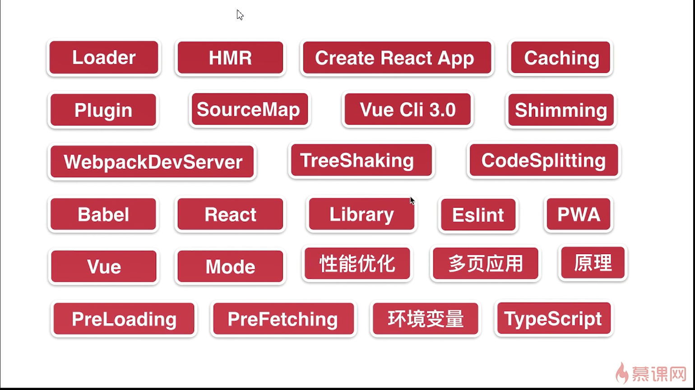
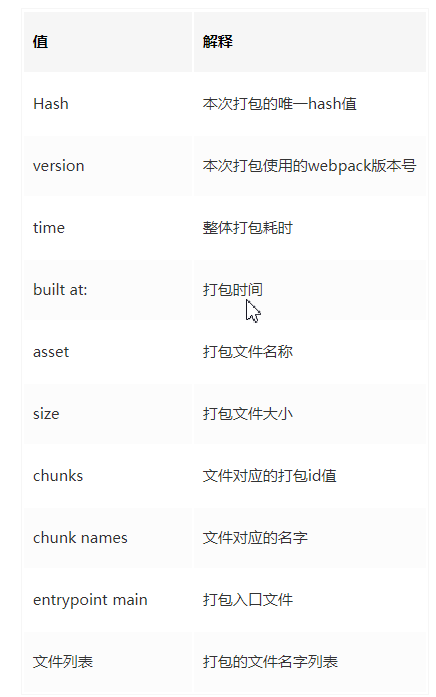

## webpack 的主要作用

### Tree shaking（删除无用模块）

### 懒加载

### 代码分割

### webpack打包输出的含义

# 第二章主要介绍了
  webpack.config.js的基础配置

# 第三章 loader && plugins
url-loader  打包图片
"style-loader",
{
  loader: "css-loader",
  options: {
    importLoaders: 2, // 通过import引入的scss文件，也要走下面两个loader
    // modules:true, //开启 css 模块化   import style from './index.scss'
  },
},
"sass-loader",
"postcss-loader",

plugins 可以再webpack运行到某一时刻时帮我做一些事情

SourceMap 

cheap-source-map   只精确到某行的错误，不会精确到列
cheap-eval-source-map  只精确到某行的错误，不会精确到列，只会管业务代码
cheap-module-eval-source-map只精确到某行的错误，不会精确到列，会loader等三方代码     dev环境最好
cheap-module-source-map只精确到某行的错误，不会精确到列，会loader等三方代码     线上可用
eval 是性能最好的，但是提示不全面