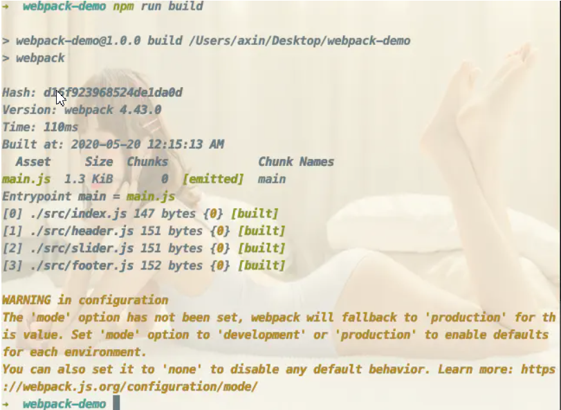

## webpack 的主要作用


### Tree shaking（删除无用模块）

### 懒加载

### 代码分割

### webpack 打包输出的含义




# 第二章主要介绍了

webpack.config.js 的基础配置

# 第三章 loader && plugins

url-loader 打包图片
"style-loader",
{
loader: "css-loader",
options: {
importLoaders: 2, // 通过 import 引入的 scss 文件，也要走下面两个 loader
// modules:true, //开启 css 模块化 import style from './index.scss'
},
},
"sass-loader",
"postcss-loader",

plugins 可以再 webpack 运行到某一时刻时帮我做一些事情

SourceMap

cheap-source-map 只精确到某行的错误，不会精确到列
cheap-eval-source-map 只精确到某行的错误，不会精确到列，只会管业务代码
cheap-module-eval-source-map 只精确到某行的错误，不会精确到列，会 loader 等三方代码 dev 环境最好
cheap-module-source-map 只精确到某行的错误，不会精确到列，会 loader 等三方代码 线上可用
eval 是性能最好的，但是提示不全面

热模块 不会刷新页面，只替换代码

new webpack.HotModuleReplacementPlugin() 热模块

if(module.hot){ //当 number.js 更新后执行回调 主要目的是一些比较小众的文件 loader 没有内置这个方法
module.hot.accept('./number',()=>{
//当 number.js 更新后 先删除之前的节点
document.body.removeChild(document.getElementById('number'))
//然后创建新节点
number()
})
}

babel

npm install --save-dev babel-loader @babel/core

webpack.config.js
rules: [
{ test: /\.js$/, exclude: /node_modules/, loader: "babel-loader" }
]

npm install @babel/preset-env --save-dev babel 的 es6=>es5 规则 让 babel-loader 以这个规则翻译

.babelrc
{
"presets": [
[
"@babel/preset-env",
"targets": {
"chrome": ">67" 表示打包后将运行在 >67 的版本里，让 babel 自行判断是否需要进行 polyfill
}
{
"useBuiltIns": "usage" 这行表示@babel/preset-env 根据业务代码来加相关的 polyfill
}
]
]
}

使用 polyfill 将 promise map 这些翻译
npm install --save @babel/polyfill //这种方式会进行全局注入 适合业务代码
使用的话 可以将在 js 文件中 import "@babel/polyfill" 但是会默认将所有的 polyfill 转义进去 造成文件过大

这种方式更适合组件库或者类库
npm install --save-dev @babel/plugin-transform-runtime

```
plugins: [
[
"@babel/plugin-transform-runtime",
{
absoluteRuntime: false,
corejs: 2,
helpers: true,
regenerator: true,
useESModules: false,
version: "7.0.0-beta.0",
},
],
```
