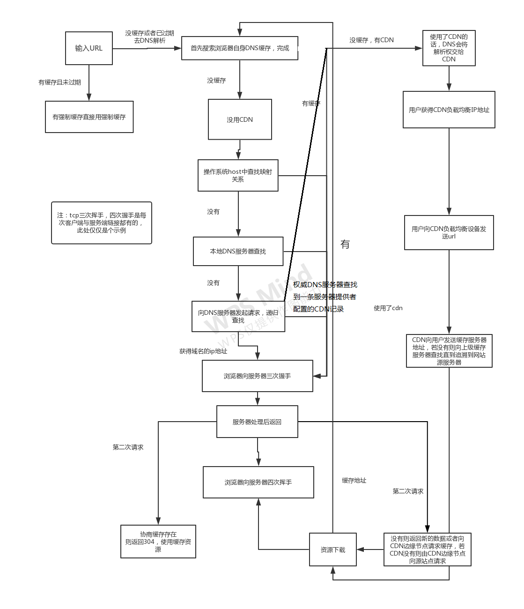

  ### 1. 加载资源的形势
  - html代码
  - 媒体文件（图片，视频等）
  - javascript，css
  ### 2. 加载过程
  -  DNS解析：域名 -> IP地址 -> CDN进行负载均衡 IP地址
  -  浏览器根据 IP地址向服务器三次握手，发起 http/TCP链接请求
      - 第一次：浏览器告诉服务器 我要发送请求了
      - 第二次：服务器告诉浏览器 我准备接收了，你发吧
      - 第三次：浏览器告诉服务器，好的我马上就发
      - 三次握手结束，浏览器发送数据

  -  服务器处理 http请求，并返回给浏览器
  
  -  数据传送完毕，需要断开 TCP链接，进行 TCP四次挥手
      - 第一次：浏览器告诉服务器 请求报文发送完毕，准备关闭
      - 第二次：服务器告诉浏览器 请求报文接收完毕，准备关闭
      - 第三次：服务器告诉浏览器 响应报文发送完毕，准备关闭
      - 第四次：浏览器告诉服务器 响应报文接收完毕，准备关闭
    
  ### 3. 渲染过程 - 1
      浏览器是多进程的，有一个主控进程，以及每一个tab页面都会新开一个进程

      a. 根据 html代码生成 DOM tree
      b. 根据 css代码生成 CSSOM
      c. 将 DOM tree 和 CSSOM 整合形成 Render Tree 
      d. 布局 render树，计算出每一个渲染对象的位置和尺寸
      e. 绘制 render树

  ### 4. 渲染过程 - 2 
    a. 根据 Render Tree渲染页面
    b. 遇到 <script> 则暂停渲染，优先加载并执行 JS代码，完成再继续

  ### 5. 完整流程图
  